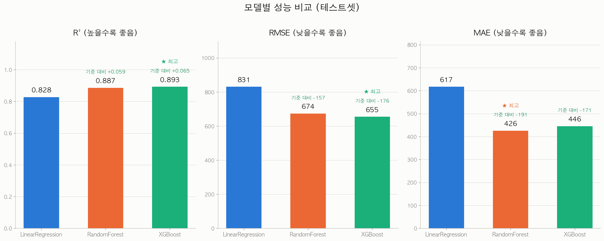
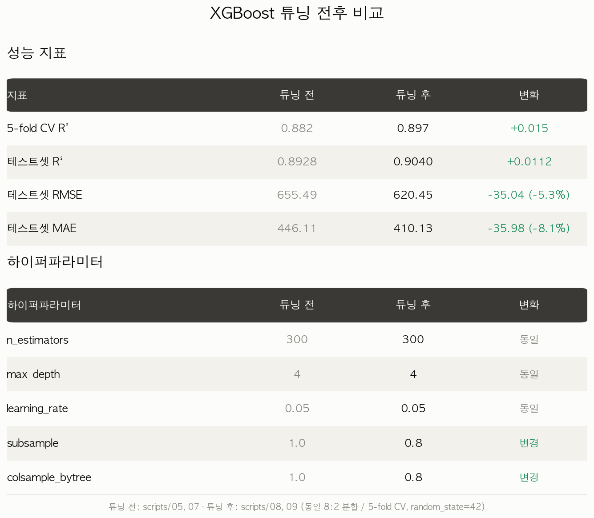
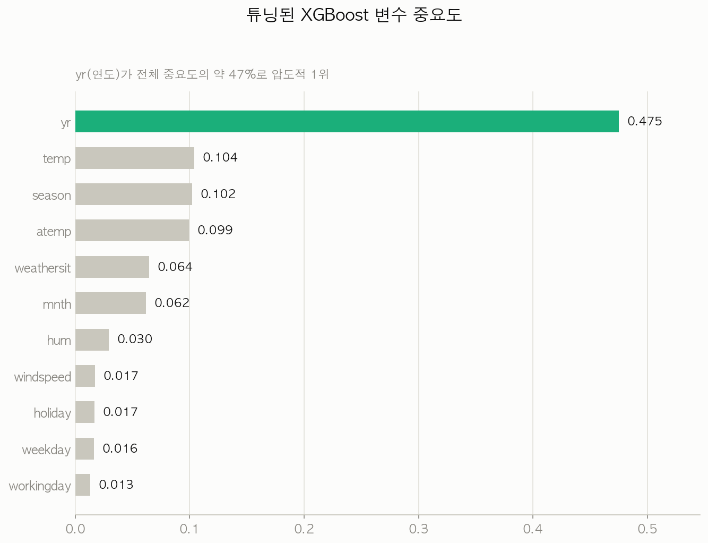

# 🚲 자전거 대여 수요 예측 (Bike Sharing Demand Prediction)

**UCI Bike Sharing Dataset**(Capital Bikeshare, 2011–2012, 731일)을 이용해 날씨·계절·시간 정보로 일일 자전거 대여 건수(`cnt`)를 예측하는 회귀 프로젝트입니다.

이 저장소는 결과 발표용 캡스톤이 아니라, **데이터 확인 → 정제 확인 → 탐색적 분석 → 시각화 → 모델링 → 결과 해석 → 문서화**로 이어지는 데이터 분석 워크플로우 전체를 재현 가능한 스크립트 12개로 남긴 기록입니다. 전 과정은 [Claude Code](https://claude.com/claude-code)를 CLI 환경에서 사용해 수행했으며, 그 과정 자체를 [`docs/CLAUDE_CODE_WORKFLOW.md`](docs/CLAUDE_CODE_WORKFLOW.md)에 별도로 정리해 두었습니다.

### 이 저장소를 처음 여셨다면

| 궁금한 것 | 볼 곳 |
|---|---|
| 무슨 분석인지, 결과가 뭔지 | 이 문서의 [데이터셋](#데이터셋) → [핵심 결과](#핵심-결과) |
| 내 컴퓨터에서 직접 돌려보고 싶다 | [재현 방법](#재현-방법) — **저장소 루트에서 실행**해야 한다는 점만 주의 |
| 분석 과정의 자세한 서술과 해석 | [`REPORT.md`](REPORT.md) |
| 이 분석을 어떻게 작업했는지(방법론) | [`docs/CLAUDE_CODE_WORKFLOW.md`](docs/CLAUDE_CODE_WORKFLOW.md) |
| 이 결과를 얼마나 믿어야 하는지 | [한계](#한계) — **먼저 읽는 것을 권합니다** |

코드를 실행하지 않아도 `output/`에 모든 차트와 학습된 모델이 들어 있어 결과만 확인할 수 있습니다.

---

## 데이터셋

| 항목 | 내용 |
|---|---|
| 출처 | UCI Machine Learning Repository — Bike Sharing Dataset (Fanaee-T & Gama, 2013), Capital Bikeshare(워싱턴 D.C.) 일별 집계 |
| 규모 | 731행 x 16열 (2011-01-01 ~ 2012-12-31), 결측치 0개 |
| 타겟 | `cnt` = `casual`(비회원) + `registered`(회원) 대여 건수 |
| 주요 입력 | `season`, `yr`, `mnth`, `holiday`, `weekday`, `workingday`, `weathersit`, `temp`, `atemp`, `hum`, `windspeed` |
| 제외 변수 | `instant`(행 번호), `dteday`(날짜 문자열), `casual`/`registered`(둘을 더하면 `cnt`와 같아지는 타겟 누수) |

## 워크플로우 개요

| 단계 | 스크립트 | 무엇을 확인했나 |
|---|---|---|
| 1. 데이터 확인 | `01_explore_data.py` | 731×16, 컬럼 타입, 결측치 0개 확인 (별도 정제 불필요) |
| 2. EDA/시각화 | `02_plot_temp_vs_cnt.py`, `03_plot_weather_season_weekday.py` | 기온-대여량 상관관계, 날씨/계절/요일 패턴 |
| 3. 베이스라인 모델 | `04_linear_regression_cnt.py` | 선형회귀 성능·계수 확인 |
| 4. 모델 비교 | `05_tree_models_cnt.py`, `06_plot_model_comparison.py` | LinearRegression vs RandomForest vs XGBoost |
| 5. 검증 | `07_cross_validate_models.py` | 5-fold 교차검증으로 순위가 우연이 아님을 확인 |
| 6. 튜닝 | `08_tune_xgboost.py` | GridSearchCV(144개 조합)로 XGBoost 최적화 |
| 7. 모델 저장 | `09_save_final_model.py` | 최종 모델 joblib + 메타데이터 저장 |
| 8. 튜닝 전후 비교 | `10_tuning_before_after_table.py` | 성능/하이퍼파라미터 변화 표 |
| 9. 결과 해석 | `11_feature_importance.py`, `12_without_yr_comparison.py` | 변수 중요도 및 `yr` 변수 원인 검증(ablation) |

## 핵심 결과

### 모델 성능 비교 (동일 8:2 분할, `random_state=42`, 테스트셋 147건)

| 모델 | R² | RMSE | MAE |
|---|---|---|---|
| LinearRegression | 0.8277 | 831.29 | 617.39 |
| RandomForest (n=300) | 0.8867 | 674.17 | **426.20** |
| XGBoost (튜닝 전) | 0.8928 | 655.49 | 446.11 |
| **XGBoost (튜닝 후, 최종 모델)** | **0.9040** | **620.45** | 410.13 |

> ⚠️ **위 수치는 `train_test_split(shuffle=True)` 기준입니다.** 이 데이터는 하루 단위로 이어지는 시계열이라, 랜덤 분할에서는 테스트 날짜의 바로 전후 날짜가 학습셋에 들어갑니다. 즉 "미래를 보고 과거를 맞히는" 상황이 되어, 실제 수요 예측 성능보다 낙관적으로 나옵니다. 자세한 내용은 [한계](#한계) 참조.

5-fold 교차검증(`07`)으로도 같은 순위를 재확인했습니다: LinearRegression 0.783±0.042 < RandomForest 0.875±0.026 < XGBoost 0.882±0.026. 단, RandomForest와 XGBoost의 차이(0.007)는 두 모델의 표준편차(±0.026)보다 작아 **둘은 사실상 동등**하며, 통계적으로 확인되는 것은 "트리 모델 > 선형회귀"까지입니다.



### XGBoost 튜닝 (GridSearchCV, 144개 조합, 5-fold CV)

최적 하이퍼파라미터: `n_estimators=300, max_depth=4, learning_rate=0.05, subsample=0.8, colsample_bytree=0.8`



### 변수 중요도와 예상 밖의 발견: `yr`

최종 모델에서 `yr`(연도, 2011 vs 2012) 하나가 전체 중요도의 **약 47%**를 차지했습니다. 이게 우연인지 확인하려고 `yr`을 뺀 채 동일 조건으로 재학습(`12_without_yr_comparison.py`)했더니 성능이 크게 나빠졌습니다.

| | R² | RMSE | MAE |
|---|---|---|---|
| `yr` 포함 | 0.904 | 620.45 | 410.13 |
| `yr` 제외 | 0.601 | 1264.89 (+103.9%) | 1048.59 (+155.7%) |

원인은 이 서비스 자체가 급성장하던 시기였다는 데 있습니다 — 일평균 대여량이 2011년 3,406건 → 2012년 5,600건(+64%)으로 늘었고, `yr`은 날씨와 무관한 이 성장 트렌드를 통째로 반영하는 변수였습니다. `yr`을 빼면 중요도 1위가 `temp`(0.234)로 바뀌면서 날씨 변수들이 원래 역할을 되찾습니다.



## 재현 방법

### 0. 요구 환경

| 항목 | 값 | 비고 |
|---|---|---|
| Python | 3.9 이상 (검증 환경: 3.9.6) | |
| OS | **macOS 권장** | 차트 스크립트가 한글 폰트를 `AppleGothic`으로 하드코딩합니다. Linux/Windows에서는 한글이 네모(□)로 깨지므로, 각 스크립트 상단의 `plt.rcParams["font.family"]`를 그 OS에 설치된 한글 폰트(예: `NanumGothic`, `Malgun Gothic`)로 바꿔야 합니다 |
| 패키지 | `requirements.txt`의 고정 버전 | **matplotlib은 3.9 이상 필수** — `03`이 `boxplot(tick_labels=...)`을 쓰는데 3.9 미만에는 이 인자가 없습니다 |

### 1. 내려받기 & 설치

```bash
# (A) git으로 받는 경우
git clone https://github.com/heeheej1996-design/bike-share-demand-portfolio-v2.git
cd bike-share-demand-portfolio-v2

# (B) GitHub에서 ZIP으로 받은 경우 — clone 불필요, 압축만 풀면 됩니다
unzip bike-share-demand-portfolio-v2-main.zip
cd bike-share-demand-portfolio-v2-main

# 패키지는 저장소 루트의 requirements.txt 하나로 공용
python3 -m pip install -r requirements.txt

# 이 분석의 작업 폴더로 이동
cd 01-washington
```

> ZIP으로 받으면 `.git` 폴더가 없어 커밋 히스토리는 볼 수 없습니다. 분석 재현 자체에는 영향이 없습니다.

### 2. 실행

> ⚠️ **반드시 `01-washington/` 폴더 안에서 실행하세요** (= `data/`, `scripts/`, `output/`이 나란히 보이는 위치).
> 모든 스크립트가 `data/day.csv`를 **상대경로**로 읽습니다. 저장소 루트나 `scripts/` 안에서 실행하면 `FileNotFoundError: data/day.csv`가 납니다.

```bash
# 순서대로 실행 (모든 스크립트는 random_state=42 고정 -> 동일한 수치 재현됨)
python3 scripts/01_explore_data.py
python3 scripts/02_plot_temp_vs_cnt.py
python3 scripts/03_plot_weather_season_weekday.py
python3 scripts/04_linear_regression_cnt.py
python3 scripts/05_tree_models_cnt.py
python3 scripts/06_plot_model_comparison.py
python3 scripts/07_cross_validate_models.py
python3 scripts/08_tune_xgboost.py
python3 scripts/09_save_final_model.py
python3 scripts/10_tuning_before_after_table.py
python3 scripts/11_feature_importance.py
python3 scripts/12_without_yr_comparison.py
```

**의존 관계는 하나뿐입니다** — `11`은 `09`가 저장한 모델 파일을 읽으므로 `09` 다음에 실행해야 합니다. 나머지는 각자 `data/day.csv`만 읽으므로 순서와 무관하게 개별 실행해도 됩니다(번호는 분석의 서술 순서입니다).

### 3. 스크립트별 입력 / 출력

| 스크립트 | 읽는 파일 | 만드는 파일 | 결과 확인 방법 |
|---|---|---|---|
| `01_explore_data.py` | `data/day.csv` | 없음 | 터미널 출력 |
| `02_plot_temp_vs_cnt.py` | `data/day.csv` | `output/02_temp_vs_cnt.png` | 차트 + 상관계수 출력 |
| `03_plot_weather_season_weekday.py` | `data/day.csv` | `output/03_weathersit_vs_cnt.png`, `output/03_season_weekday_heatmap.png` | 차트 2장 + 집계표 출력 |
| `04_linear_regression_cnt.py` | `data/day.csv` | 없음 | 성능 지표·회귀계수 출력 |
| `05_tree_models_cnt.py` | `data/day.csv` | 없음 | 모델 3종 비교표 출력 |
| `06_plot_model_comparison.py` | `data/day.csv` | `output/06_model_comparison.png` | 차트 |
| `07_cross_validate_models.py` | `data/day.csv` | 없음 | 5-fold CV 결과 출력 |
| `08_tune_xgboost.py` | `data/day.csv` | 없음 | 최적 조합·상위 5개 조합 출력 |
| `09_save_final_model.py` | `data/day.csv` | `output/09_final_xgboost_model.joblib`, `output/09_final_model_info.json` | 최종 성능 출력 |
| `10_tuning_before_after_table.py` | 없음 (수치 하드코딩) | `output/10_tuning_before_after.png` | 표 이미지 |
| `11_feature_importance.py` | `output/09_final_*` (09 실행 필요) | `output/11_feature_importance.png` | 차트 + 중요도 순위 출력 |
| `12_without_yr_comparison.py` | `data/day.csv` | 없음 | `yr` 포함/제외 비교표 출력 |

### 4. 실행 시 알아둘 점

- **소요 시간**: 대부분 수 초 이내입니다. 가장 무거운 `08`(GridSearchCV 144조합 x 5-fold = 720회 학습)도 8코어 기준 약 10초입니다.
- **`output/`은 덮어쓰기됩니다.** 이 저장소에는 위 명령을 실행해 생성한 결과물이 이미 커밋되어 있어서, 재실행하면 같은 내용으로 덮어씁니다(수치가 고정이라 결과는 동일합니다).
- **무해한 경고 하나**: `requirements.txt` 조합(numpy 2.0.2 + scikit-learn 1.6.1)에서 `04`/`05`/`06` 실행 시 `RuntimeWarning: divide by zero / overflow / invalid value encountered in matmul`이 여러 줄 출력됩니다. **출력되는 성능 지표는 정상이며 [핵심 결과](#핵심-결과)의 수치와 정확히 일치합니다.** 놀라지 말고 넘어가면 됩니다.

## 프로젝트 구조

저장소는 분석 대상별로 폴더가 나뉘어 있고, 이 문서는 그중 `01-washington/`을 다룹니다.

```
bike-share-demand-portfolio-v2/
├── requirements.txt                   # 두 분석 공용 (고정 버전 6개)
├── .gitignore
├── 02-london/                         # 런던 데이터셋 분석 (완료)
└── 01-washington/                     # ← 이 문서가 설명하는 분석
    ├── README.md                      # 이 문서 (요약 + 재현 방법)
    ├── REPORT.md                      # 상세 분석 리포트 (수치 해석 중심)
    ├── data/
    │   └── day.csv                        # 원본 데이터 731행 x 16열 (저장소에 동봉 -> 별도 다운로드 불필요)
    ├── scripts/                           # 01~12, 번호가 곧 실행 순서
    │   ├── 01_explore_data.py             # 데이터 구조·결측치 확인
    │   ├── 02_plot_temp_vs_cnt.py         # 기온 vs 대여량 산점도
    │   ├── 03_plot_weather_season_weekday.py  # 날씨 boxplot + 계절x요일 히트맵
    │   ├── 04_linear_regression_cnt.py    # 베이스라인 선형회귀
    │   ├── 05_tree_models_cnt.py          # LinearRegression/RandomForest/XGBoost 비교
    │   ├── 06_plot_model_comparison.py    # 위 비교를 차트로
    │   ├── 07_cross_validate_models.py    # 5-fold 교차검증
    │   ├── 08_tune_xgboost.py             # GridSearchCV 튜닝 (가장 오래 걸림)
    │   ├── 09_save_final_model.py         # 최종 모델 저장
    │   ├── 10_tuning_before_after_table.py# 튜닝 전후 비교 표 이미지
    │   ├── 11_feature_importance.py       # 변수 중요도 (09 결과물 필요)
    │   └── 12_without_yr_comparison.py    # yr 제외 ablation
    ├── output/                            # 스크립트 실행 결과물 (재실행하면 덮어쓰기됨)
    │   ├── 02_temp_vs_cnt.png
    │   ├── 03_weathersit_vs_cnt.png
    │   ├── 03_season_weekday_heatmap.png
    │   ├── 06_model_comparison.png
    │   ├── 09_final_xgboost_model.joblib  # 학습 완료된 최종 XGBoost 모델
    │   ├── 09_final_model_info.json       # 하이퍼파라미터·피처 목록·분할 조건·성능
    │   ├── 10_tuning_before_after.png
    │   └── 11_feature_importance.png
    └── docs/
        └── CLAUDE_CODE_WORKFLOW.md    # Claude Code로 이 분석을 수행한 과정 정리
```

출력 파일 이름 앞의 번호 = 그 파일을 만든 스크립트 번호입니다.

### 저장된 모델 바로 써보기

`09_final_model_info.json`에 피처 순서·하이퍼파라미터·분할 조건이 모두 기록되어 있어, 학습 없이 모델만 불러 쓸 수 있습니다.

```python
import joblib, json, pandas as pd

model = joblib.load("output/09_final_xgboost_model.joblib")
info = json.load(open("output/09_final_model_info.json", encoding="utf-8"))

df = pd.read_csv("data/day.csv")
pred = model.predict(df[info["feature_cols"]])   # feature_cols 순서를 반드시 지킬 것
```

## 사용 기술

Python 3.9.6 · pandas 2.3.3 · numpy 2.0.2 · scikit-learn 1.6.1 (LinearRegression, RandomForestRegressor, GridSearchCV, KFold) · XGBoost 2.1.4 · matplotlib 3.9.4 · joblib 1.5.3

이 버전 조합에서 README·REPORT의 모든 수치가 재현되는 것을 확인했습니다.

## 한계

- **평가 분할이 시계열 특성을 반영하지 않습니다.** 이 프로젝트는 `04`~`12` 전 구간에서 `train_test_split(shuffle=True, random_state=42)`을 사용했는데, 731일이 하루씩 이어지는 시계열 데이터에서 랜덤 분할은 테스트 날짜의 인접일(전날·다음날)을 학습셋에 남깁니다. 실제 수요 예측은 항상 "과거로 미래를 예측"하는 형태이므로, 시간순 분할(앞 80% 학습 / 뒤 20% 테스트)로 재평가하면 위 수치보다 성능이 낮게 나오는 것이 정상입니다. 현재 수치는 **모델 간 상대 비교로는 유효하지만, 실제 운영 성능의 추정치로 읽어서는 안 됩니다.** 시간순 분할 재평가와 나이브 기준선(어제 대여량 그대로 예측) 대비 비교는 후속 과제로 남겨두었습니다.
- 하이퍼파라미터 튜닝(`08`)의 `GridSearchCV`가 학습셋이 아닌 전체 데이터에 대해 수행되어, 최적 조합 선택 과정에 테스트셋 정보가 일부 반영되었습니다. 이 역시 후속 수정 대상입니다.
- `yr`은 값이 0/1 두 개뿐인 변수라, 이 모델은 사실상 "2011년 수준 vs 2012년 수준" 두 기준선만 학습했습니다. 2013년 이후처럼 관측되지 않은 연도를 예측할 때는 `yr`이 그 시점의 성장 수준을 대변해주지 못해 예측력이 떨어질 수 있습니다.
- `weathersit=4`(폭우/폭설 등 최악 등급)에 해당하는 날이 원본 데이터에 없어(0건), 해당 등급에 대한 모델의 예측은 검증되지 않았습니다.

### 코드상 알려진 제약

분석 결론과는 별개로, 코드를 그대로 가져다 쓸 때 걸릴 수 있는 지점입니다.

- **`10_tuning_before_after_table.py`는 수치를 계산하지 않고 하드코딩합니다.** 표 이미지를 그리는 용도라 `05`/`07`/`08`/`09`의 결과값이 코드 안에 문자열로 박혀 있습니다. 데이터나 하이퍼파라미터를 바꾸면 다른 스크립트 출력은 따라 바뀌지만 **이 표만 조용히 옛날 값을 그립니다.** 수정 시 함께 갱신해야 합니다.
- **경로가 상대경로로 고정**되어 있어 저장소 루트에서만 실행됩니다. ([재현 방법](#2-실행) 참조)
- **한글 폰트가 `AppleGothic`으로 하드코딩**되어 macOS 외 환경에서는 차트 글자가 깨집니다.
- `08`의 `GridSearchCV`는 `n_jobs=-1`로 전체 코어를 사용합니다. 코어 수에 따라 실행 시간이 달라집니다(결과값은 동일).

## 데이터 출처 및 라이선스

- **데이터**: [UCI Machine Learning Repository — Bike Sharing Dataset](https://archive.ics.uci.edu/dataset/275/bike+sharing+dataset) (Fanaee-T, H. & Gama, J., 2013, *Event labeling combining ensemble detectors and background knowledge*, Progress in Artificial Intelligence). 원본 배포본의 `day.csv`(일별 집계)를 그대로 포함했습니다. 같은 데이터셋의 `hour.csv`(시간별)는 **이 프로젝트에서 사용하지 않으며 포함되어 있지 않습니다.**
- **코드**: 저장소 루트의 [`LICENSE`](../LICENSE)(MIT)를 따릅니다. 데이터셋 자체의 라이선스는 별도이니(위 항목) 코드와 혼동하지 마세요.
