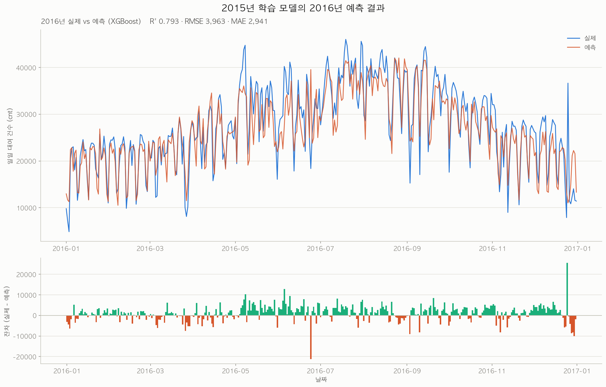

# 🚲 런던 자전거 대여 수요 예측 (London Bike Sharing)

**London Bike Sharing Dataset**(Santander Cycles, 2015-01-04 ~ 2017-01-03)을 이용해 날씨·계절 정보로 일일 자전거 대여 건수(`cnt`)를 예측하는 회귀 프로젝트입니다.

[`01-washington/`](../01-washington/)과 같은 워크플로우를 따르되, 런던 원본이 **시간 단위**로 제공되기 때문에 **시간별 → 일별 집계 단계가 먼저 붙습니다.** 집계 규칙은 워싱턴 데이터에서 역추출한 [규칙서](../01-washington/docs/HOURLY_TO_DAILY_AGGREGATION.md)를 그대로 적용했습니다.

> ✅ **현재 상태: 완료** — 2015년 학습 → 2016년 예측, **테스트 R² 0.7933** (튜닝된 XGBoost)

### 이 폴더를 처음 여셨다면

| 궁금한 것 | 볼 곳 |
|---|---|
| 무슨 분석이고 결과가 뭔지 | 이 문서의 [핵심 결과](#핵심-결과) |
| 분석 과정의 자세한 서술과 해석 | [`REPORT.md`](REPORT.md) |
| 어떤 계획으로 진행했는지 | [`docs/ANALYSIS_PLAN.md`](docs/ANALYSIS_PLAN.md) — **통합 분석 계획** |
| 시간별→일별 변환을 어떻게 했는지 | [`docs/CONVERSION_PLAN.md`](docs/CONVERSION_PLAN.md) |
| 워싱턴과 컬럼이 어떻게 다른지 | [`docs/COLUMN_COMPARISON.md`](docs/COLUMN_COMPARISON.md) |
| 내 컴퓨터에서 돌려보고 싶다 | [재현 방법](#재현-방법) |
| 이 결과를 얼마나 믿어야 하는지 | [한계](#한계) — **먼저 읽는 것을 권합니다** |

## 핵심 결과

**2015년 355일로 학습해 2016년 365일을 예측: R² 0.7933 · RMSE 3,963 · MAE 2,941 (MAPE 12.4%)**

| 모델 | 2016년 R² |
|---|---|
| 전체 평균 (기준선) | −0.0086 |
| 월별 평균 | 0.4786 |
| 요일×월 평균 | 0.5168 |
| **최종 모델 (튜닝된 XGBoost)** | **0.7933** |



### 모델 성능 비교 (`07_tree_models.py`, 튜닝 전, 2016년 테스트 기준)

| 모델 | R² | RMSE | MAE |
|---|---|---|---|
| *기준선 (요일×월 평균)* | *0.5168* | *6,059* | *4,692* |
| 선형회귀 | 0.7729 | 4,154 | 3,287 |
| 랜덤포레스트 | 0.7752 | 4,132 | 3,158 |
| **XGBoost (튜닝 전)** | **0.7833** | **4,057** | **3,050** |

세 모델의 차이(R² 0.77~0.78)는 크지 않습니다. `08_cross_validate.py`의 시간순/월블록 교차검증에서는 선형회귀와 XGBoost가 통계적으로 구분되지 않았고([`REPORT.md` 6절](REPORT.md#6-교차검증--검증-설계가-결론을-바꿉니다-08_cross_validatepy)), 최종적으로는 2016년 테스트 성능 기준으로 XGBoost를 골라 튜닝했습니다(`09`~`10`) — 이 선택 절차 자체가 한계로 기록돼 있습니다(아래 [한계](#한계) 참조).

### 워싱턴과 달랐던 세 가지

| | 워싱턴 | 런던 |
|---|---|---|
| 최고 모델 | XGBoost (0.904) | **XGBoost (0.7933)** — 단, 시간순/월블록 CV에서는 선형회귀와 통계적으로 구분 안 됨(REPORT 6절) |
| 최강 변수 | `yr` (중요도 47%) | **`yr` 사용 불가** — train 상수 / test 미지값 |
| 평가 방식 | 랜덤 8:2 분할 | **완전한 시간 분리** (2015 → 2016) |

두 R² 수치를 직접 비교하면 안 됩니다. 워싱턴 문서는 0.904를 "낙관적으로 부풀려진 수치"라고 스스로 기록했습니다. 자세한 내용은 [한계](#한계) 참조.

---

## 데이터셋

| 항목 | 원본 (시간별) | 변환 결과 (일별) |
|---|---|---|
| 파일 | `data/london_merged.csv` | `data/london_daily.csv` |
| 규모 | 17,414행 × 10열 | **730행 × 17열** |
| 기간 | 2015-01-04 ~ 2017-01-03 (달력상 731일) | 동일 |
| 단위 | 1시간 | 1일 |
| 타겟 | — | `cnt` (회원/비회원 구분 없음) |

달력상 731일인데 730행인 이유는 `2016-09-02`가 24시간 전부 결측이기 때문입니다. 0으로 채우지 않았습니다.

### 워싱턴과 다른 점

| | 워싱턴 | 런던 |
|---|---|---|
| 제공 단위 | 시간별 + **일별 원본** | **시간별만** |
| `temp`/`hum`/`windspeed` | 0~1 정규화 | **섭씨·%·km/h 원값** (`t1`,`t2`,`hum`,`wind_speed`) |
| 날씨 | `weathersit` 1~4 (연속 등급) | **`weather_code` 1,2,3,4,7,10,26** (불규칙 기상청 코드) |
| `season` | 천문학적(춘분 기준), 1=겨울 | **기상학적(월 시작), 0=봄** |
| 이용자 구분 | `casual` / `registered` | **없음** (`cnt` 총합만) |
| 서머타임 | 없음 | **BST 전환 있음** (전환일 4일은 하루가 23/25시간) |

자세한 대조는 [`docs/COLUMN_COMPARISON.md`](docs/COLUMN_COMPARISON.md)에 있습니다.

## 워크플로우 개요

| 단계 | 스크립트 | 무엇을 하나 |
|---|---|---|
| 1. 시간별 → 일별 집계 | `01_hourly_to_daily.py` | 워싱턴 규칙 적용, 730일 생성 |
| 2. 연도별 분리 | `02_split_by_year.py` | 2015 / 2016 분리, 2017년 3일 제외 |
| 3. 전처리 확인 | `03_explore_data.py` | train/test 대조, **`yr` 제외 근거 확인** |
| 4. EDA·시각화 | `04_eda_visualization.py` | 기온·날씨·계절 패턴, 월별 추이 |
| 5. **이상치 탐지** | `05_outlier_detection.py` | IQR·z-score·**잔차** 3종 대조 |
| 6. **베이스라인** | `06_baseline_models.py` | 나이브 기준선 3종 + 선형회귀 |
| 7. 모델 비교 | `07_tree_models.py` | Linear / RandomForest / XGBoost |
| 8. 교차검증 | `08_cross_validate.py` | **TimeSeriesSplit** (2015 내부) |
| 9. 튜닝 | `09_tune_best_model.py` | GridSearchCV (**2015만 사용**) |
| 10. 최종 예측 | `10_final_predict_2016.py` | 학습 → 2016 예측 → 모델 저장 |
| 11. 변수 중요도 | `11_feature_importance.py` | 순열 중요도 + ablation |
| 12. **오차 분석** | `12_error_analysis.py` | 어디서 왜 틀렸는지 |

## 재현 방법

### 0. 요구 환경

Python 3.9 이상, 루트 `requirements.txt`의 고정 버전. 변환 스크립트는 **pandas와 numpy만** 사용하며 한글 폰트가 필요 없어 OS를 가리지 않습니다.

### 1. 실행

> ⚠️ **반드시 `02-london/` 폴더 안에서 실행하세요** (= `data/`, `scripts/`, `output/`이 나란히 보이는 위치).
> 스크립트가 `data/...`를 **상대경로**로 읽고 씁니다.

```bash
python3 -m pip install -r ../requirements.txt   # 루트 requirements.txt 공용
cd 02-london
python3 scripts/01_hourly_to_daily.py     # 시간별 -> 일별 (730일)
python3 scripts/02_split_by_year.py       # 연도별 분리 (2015 / 2016)
python3 scripts/03_explore_data.py
python3 scripts/04_eda_visualization.py
python3 scripts/05_outlier_detection.py
python3 scripts/06_baseline_models.py
python3 scripts/07_tree_models.py
python3 scripts/08_cross_validate.py
python3 scripts/09_tune_best_model.py
python3 scripts/10_final_predict_2016.py
python3 scripts/11_feature_importance.py
python3 scripts/12_error_analysis.py
```

**의존 관계는 두 개뿐입니다** — `10`은 `09`가 저장한 하이퍼파라미터를, `11`/`12`는 `10`이 저장한 모델을 읽습니다. 나머지는 독립 실행 가능합니다.
모든 스크립트는 `random_state=42` 고정이라 재실행해도 같은 수치가 나옵니다.

> **무해한 경고** — `05`/`06`/`07` 실행 시 numpy 2.0.2 + scikit-learn 1.6.1 조합에서 `RuntimeWarning: divide by zero / overflow ... in matmul`이 출력됩니다. 워싱턴과 동일한 현상이며 **출력 수치는 정상입니다.**

`01`은 입력 요약, 기록 시간 분포, `weather_code` 경고를 출력하고 `data/london_daily.csv`를 씁니다.
`02`는 이를 연도별로 나눠 `london_daily_2015.csv` / `london_daily_2016.csv`를 씁니다.

### 2. 다른 기간 데이터 넣기

코드 수정 없이 인자로 처리합니다.

```bash
python3 scripts/01_hourly_to_daily.py --input data/london_2018.csv \
                                      --output data/london_2018_daily.csv \
                                      --year-base 2015
```

| 인자 | 기본값 | 설명 |
|---|---|---|
| `--input` | `data/london_merged.csv` | 시간별 입력 파일 |
| `--output` | `data/london_daily.csv` | 일별 출력 파일 |
| `--year-base` | 입력 파일의 첫 연도 | `yr=0`으로 삼을 연도. **여러 기간 파일을 각각 변환할 때 반드시 같은 값을 지정하세요** |
| `--fill-missing-dates` | 꺼짐 | 24시간 전부 결측인 날짜도 행으로 남김 (집계값 `NaN`) |

컬럼 이름이 다르면 스크립트 상단의 `TS_COL` / `SUM_COLS` / `MEAN_COLS` / `ROUND_COLS` / `CONST_COLS` 상수만 고치면 됩니다.

### 3. 스크립트별 입력 / 출력

| 스크립트 | 읽는 파일 | 만드는 파일 | 결과 확인 방법 |
|---|---|---|---|
| `01_hourly_to_daily.py` | `data/london_merged.csv` | `data/london_daily.csv` | 터미널 요약 + 출력 CSV |
| `02_split_by_year.py` | `data/london_daily.csv` | `data/london_daily_2015.csv`, `data/london_daily_2016.csv` | 터미널 요약 + 출력 CSV 2개 |

`02`는 일수가 `--min-days`(기본 30) 미만인 연도를 자동으로 제외합니다. 런던 2017년은 1/1~1/3 **3일뿐**이라 여기서 빠집니다. `--years 2015 2016`으로 직접 지정할 수도 있습니다.

**`instant`는 각 연도 파일 안에서 1부터 다시 매깁니다.** `instant`는 그 파일의 행 번호이지 날짜의 고유 ID가 아닙니다. 파일을 다시 합칠 때는 `instant`가 아니라 `dteday`를 키로 쓰세요.

## 출력 스키마 (17개 컬럼)

| 컬럼 | 출처 | 규칙 |
|---|---|---|
| `instant` | 신규 | 1~730 재생성 |
| `dteday` | `timestamp` | 날짜 추출 |
| `season` | 원본 | `first` (0=봄, 1=여름, 2=가을, 3=겨울) |
| `yr` | 신규 | `year - year_base` (2015=0) |
| `mnth` | 신규 | 1~12 |
| `weekday` | 신규 | 0=일요일 (워싱턴 규약) |
| `holiday` | `is_holiday` | `first` |
| `workingday` | 신규 | `(1-holiday) × (1-is_weekend)` |
| `is_weekend` | 원본 | `first` |
| `weather_code` | 원본 | `mean` → half-up |
| `t1` `t2` `hum` `wind_speed` | 원본 | `mean` |
| `cnt` | 원본 | `sum` |
| `n_hours` | 신규 | 그날 기록된 시간 수 (24시간 온전 696일 / 빠진 날 34일) |
| `coverage` | 신규 | `n_hours / 24` |

## 한계

**먼저 읽어야 할 것들입니다.**

- **모델 선택 절차에 테스트 정보가 일부 반영됐습니다.** 월블록 교차검증(`08`)에서 선형회귀와 XGBoost가 통계적으로 구분되지 않았는데, 2016년 테스트 성능을 보고 XGBoost를 최종 선택했습니다. 튜닝 후에는 CV에서도 XGBoost가 앞서 결과적으로 정합적이지만, 선택 순서상 R² 0.7933은 **낙관적으로 볼 여지가 있습니다.** 자세한 내용은 [`REPORT.md` 13절](REPORT.md#13-한계).
- **워싱턴 R² 0.904와 직접 비교하면 안 됩니다.** 워싱턴은 랜덤 분할이라 테스트일의 전날·다음날이 학습셋에 있었고, 문서 스스로 "낙관적으로 부풀려진 수치"라고 기록했습니다. 이번 0.7933은 완전한 시간 분리 조건에서 나온 값이라 성격이 다릅니다.
- **모델이 체계적으로 과소예측합니다.** 2016년 수요가 2015년보다 3.2% 높은데 `yr`을 제외했으므로 성장분을 담을 변수가 없습니다(잔차 평균 +1,050). `yr` 제외 결정의 알려진 대가입니다.
- **학습 데이터가 355일뿐입니다.** 계절별로 약 90일씩이라 특정 계절의 이상 기후가 학습을 왜곡할 수 있습니다.
- **이상치 2일(2015-07-09, 08-06)의 원인이 미검증입니다.** 지하철 파업 가설을 외부 자료로 확인하지 않았습니다.
- **`weather_code`에 구조적 결함이 있습니다.** 일별 집계 과정에서 730일 중 56일이 원본 코드 체계에 없는 값이 됐습니다. 예측에는 기여하지만 등급으로 해석하면 안 됩니다.
- **`holiday` 플래그가 대체휴일 체계를 따릅니다.** 2016-12-25가 `holiday=0`이라 그 해 최대 오차(+22,038)가 발생했습니다. 자세한 내용은 [`REPORT.md` 11절](REPORT.md#11-오차-분석-12_error_analysispy).
- **`casual`/`registered`가 없습니다.** 런던 원본에 이용자 구분이 없어 회원/비회원 분석은 불가능합니다.

## 프로젝트 구조

```
02-london/
├── README.md                       # 이 문서
├── REPORT.md                       # 변환 결과 리포트
├── data/
│   ├── london_merged.csv           # 원본 시간별 17,414행 x 10열
│   ├── london_daily.csv            # 변환 결과 730행 x 17열
│   ├── london_daily_2015.csv       # Train 362일
│   └── london_daily_2016.csv       # Test  365일
├── scripts/
│   ├── common.py                   # 피처 목록·차트 스타일 공용 설정
│   ├── 01_hourly_to_daily.py       # 시간별 -> 일별 집계
│   ├── 02_split_by_year.py         # 연도별 분리
│   ├── 03_explore_data.py          # 전처리 확인
│   ├── 04_eda_visualization.py     # EDA 차트 4종
│   ├── 05_outlier_detection.py     # 이상치 탐지 3종
│   ├── 06_baseline_models.py       # 나이브 기준선
│   ├── 07_tree_models.py           # 모델 비교
│   ├── 08_cross_validate.py        # TimeSeriesSplit CV
│   ├── 09_tune_best_model.py       # GridSearchCV
│   ├── 10_final_predict_2016.py    # 최종 예측 (11/12의 선행 조건)
│   ├── 11_feature_importance.py    # 순열 중요도 + ablation
│   └── 12_error_analysis.py        # 오차 분석
├── output/                         # 차트 PNG, 학습된 모델, 예측 결과
└── docs/
    ├── ANALYSIS_PLAN.md            # 통합 분석 계획
    ├── CONVERSION_PLAN.md          # 변환 계획안
    └── COLUMN_COMPARISON.md        # 워싱턴 <-> 런던 컬럼 대조
```

### 저장된 모델 바로 써보기

```python
import joblib, json, pandas as pd

model = joblib.load("output/10_final_model.joblib")
info = json.load(open("output/10_final_model_info.json", encoding="utf-8"))

df = pd.read_csv("data/london_daily_2016.csv")
pred = model.predict(df[info["feature_cols"]])   # feature_cols 순서를 반드시 지킬 것
```

## 데이터 출처 및 라이선스

- **데이터**: London Bike Sharing Dataset — Transport for London(TfL) 공개 자전거 대여 기록과 freemeteo.com 기상 데이터를 결합한 것으로, Kaggle에 공개된 `london_merged.csv`를 그대로 포함했습니다. TfL 원자료는 [Powered by TfL Open Data](https://tfl.gov.uk/info-for/open-data-users/) 조건을 따릅니다.
- **코드**: 저장소 루트의 [`LICENSE`](../LICENSE)(MIT)를 따릅니다. 데이터셋 자체의 라이선스는 별도이니(위 항목) 코드와 혼동하지 마세요.
