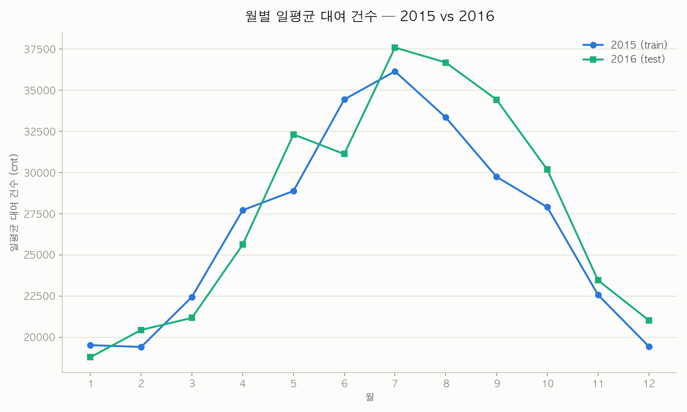
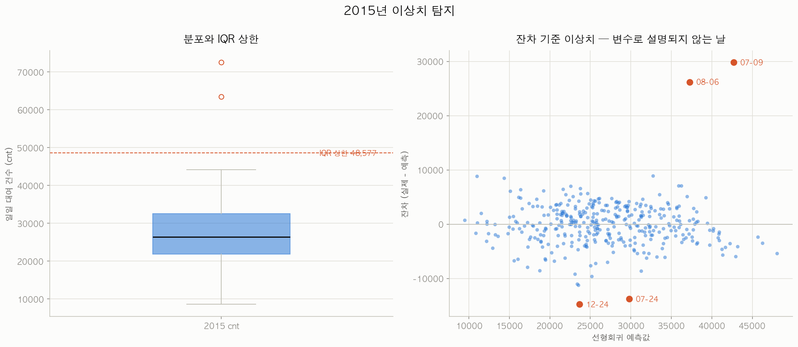
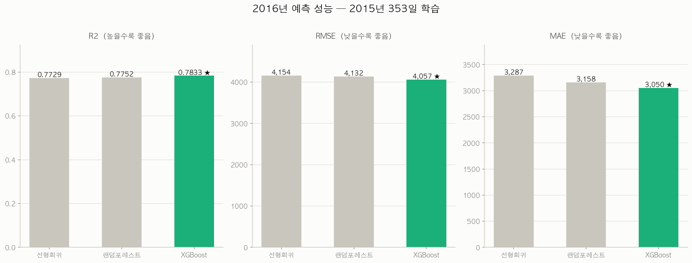
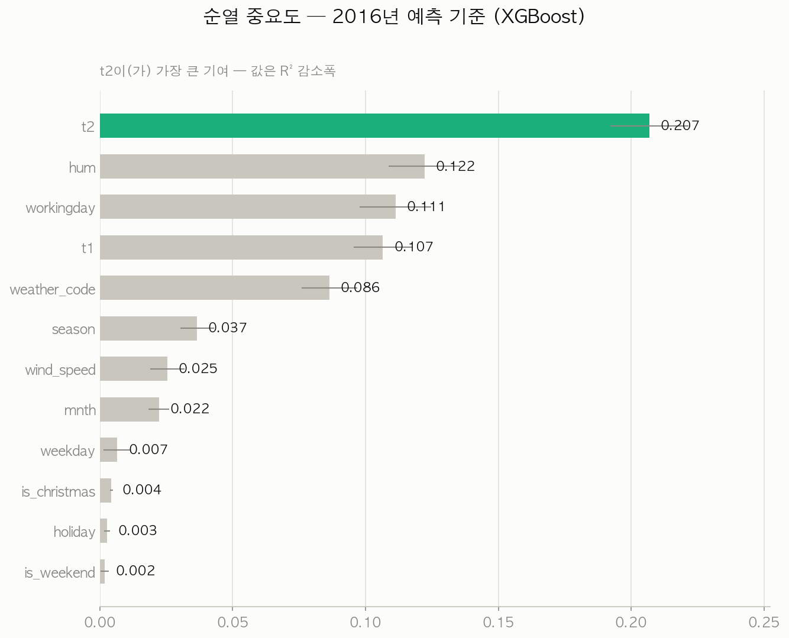
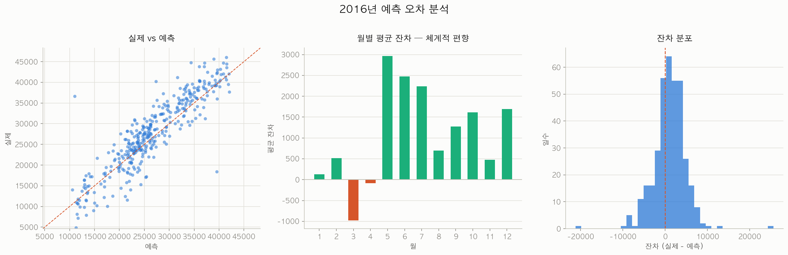

# 분석 리포트: 런던 자전거 대여 수요 예측

**2015년 데이터로 회귀 모델을 학습해 2016년 일일 대여량(`cnt`)을 예측했습니다.**

| | 데이터 | 규모 |
|---|---|---|
| Train | `data/london_daily_2015.csv` | 362일 (학습 사용 355일) |
| Test | `data/london_daily_2016.csv` | 365일 전체 |

**최종 모델: XGBoost — R² 0.7933 · RMSE 3,963 · MAE 2,941 (MAPE 12.4%)**

계획서는 [`docs/ANALYSIS_PLAN.md`](docs/ANALYSIS_PLAN.md), 데이터 변환 기록은 [`docs/CONVERSION_PLAN.md`](docs/CONVERSION_PLAN.md)에 있습니다.

---

## 1. 데이터 확인 (`03_explore_data.py`)

두 파일 모두 결측치 0개, 컬럼·타입 일치. 별도 정제는 불필요했습니다. 대신 **피처 설계에서 두 가지를 걸러냈습니다.**

### `yr`을 제외했습니다

```
train(2015) yr 고유값 : [0]   <- 상수. 배울 정보가 없음
test (2016) yr 고유값 : [1]   <- 학습에서 본 적 없는 값
```

연도로 파일을 나눴으니 당연한 결과지만, 하필 **워싱턴에서 중요도 1위(47%)였던 변수**입니다. 코드를 그대로 옮겼다면 가장 중요한 자리에 아무 정보 없는 상수가 들어갔을 것입니다.

다행히 런던은 2015→2016 일평균이 26,903 → 27,752건으로 **+3.2%** 성장에 그쳐(워싱턴은 +64%) 이 변수를 잃는 손실이 작습니다.

### `n_hours`/`coverage`를 제외했습니다

"그날 몇 시간이 기록됐는가"는 실제 예측 시점에 알 수 없는 사후 정보입니다. 학습 데이터 필터링에만 사용했습니다.

### 최종 피처 12개

| 구분 | 변수 |
|---|---|
| 날씨 (5) | `t1`, `t2`, `hum`, `wind_speed`, `weather_code` |
| 달력 (6) | `season`, `mnth`, `weekday`, `workingday`, `is_weekend`, `holiday` |
| 파생 (1) | `is_christmas` — 9절 참고 |

워싱턴과 달리 `casual`/`registered`가 없어 타겟 누수 위험은 없습니다.

### 분포 대조

| 컬럼 | 2015 평균 | 2016 평균 | 차이 |
|---|---|---|---|
| `cnt` | 26,903 | 27,752 | +3.2% |
| `t1` | 12.63 | 12.40 | −1.8% |
| `hum` | 71.36 | 73.15 | +2.5% |
| `wind_speed` | 16.69 | 15.23 | −8.8% |

분포 이동이 작아 별도 보정 없이 학습했습니다.

## 2. 탐색적 분석 (`04_eda_visualization.py`)

- **기온-대여량 상관계수 +0.638** — 워싱턴(+0.63)과 거의 같습니다.
- **계절×요일 히트맵** — 여름 목요일 41,035건 최고, 겨울 일요일 12,952건 최저. **3배 차이**입니다.
- **월별 패턴 상관계수 0.936** — 2015년과 2016년의 계절 곡선이 매우 닮았습니다. **연도 간 전이 학습이 가능하다는 근거**입니다.



## 3. 이상치 탐지 (`05_outlier_detection.py`)

세 방법을 대조했고, **잔차 기준이 나머지 둘이 놓친 2일을 추가로 잡았습니다.**

| 날짜 | `cnt` | IQR | z-score | 잔차 |
|---|---|---|---|---|
| 2015-07-09 | 72,504 | ✅ | ✅ | ✅ |
| 2015-08-06 | 63,468 | ✅ | ✅ | ✅ |
| 2015-07-24 | 16,034 | — | — | ✅ |
| 2015-12-24 | 8,908 | — | — | ✅ |

**잔차 기준이 핵심인 이유** — 2015-07-09는 IQR로도 잡히지만, 잔차로 보면 "이 날씨면 42,713건이어야 하는데 72,504건"이라는 사실이 드러납니다. 반대로 7/24와 12/24는 절대값이 평범해 분포 기준으로는 안 걸리지만, **날씨 대비 지나치게 낮아** 잔차로만 탐지됩니다.

세 방법이 모두 지목한 2일(7/9, 8/6)은 **날씨 좋음·평일·24시간 온전 기록**이라 데이터 오류가 아닙니다. 유력한 가설은 런던 지하철 파업이지만 **외부 자료로 확인하지 않았으므로 미검증으로 둡니다.**



`coverage < 0.90`인 7일도 학습에서 제외했습니다(362일 → 355일).

## 4. 베이스라인 (`06_baseline_models.py`)

**워싱턴에 없던 단계입니다.** 기준선 없이 R²만 보면 모델이 잘한 건지 알 수 없습니다.

| 기준선 | R² | RMSE | MAE |
|---|---|---|---|
| ① 전체 평균 | −0.0086 | 8,754 | 7,123 |
| ② 월별 평균 | 0.4786 | 6,294 | 5,317 |
| ③ 요일×월 평균 | 0.5168 | 6,059 | 4,692 |
| ④ 선형회귀 | 0.7753 | 4,132 | 3,240 |

달력 정보만으로 R² 0.52까지 갑니다. **이후 모든 모델은 최소한 0.5168을 넘어야 의미가 있습니다.**

## 5. 모델 비교 (`07_tree_models.py`)

| 모델 | R² ↑ | RMSE ↓ | MAE ↓ |
|---|---|---|---|
| *기준선 (요일×월 평균)* | *0.5168* | *6,059* | *4,692* |
| 선형회귀 | 0.7729 | 4,154 | 3,287 |
| 랜덤포레스트 | 0.7752 | 4,132 | 3,158 |
| **XGBoost** | **0.7833** | **4,057** | **3,050** |

XGBoost가 세 지표 모두 1위입니다. 다만 세 모델의 차이는 크지 않고(R² 0.77~0.78), **셋 다 기준선을 크게 앞선다는 점**이 더 중요합니다.



## 6. 교차검증 — 검증 설계가 결론을 바꿉니다 (`08_cross_validate.py`)

**이 프로젝트에서 가장 중요한 방법론적 발견입니다.** 같은 데이터·같은 모델인데 검증 방식에 따라 순위가 뒤집힙니다.

| 모델 | A. KFold(shuffle) | B. TimeSeriesSplit | **C. 월 블록** |
|---|---|---|---|
| 선형회귀 | 0.7679 | **0.3959** | **0.4358** |
| 랜덤포레스트 | **0.8147** | 0.2556 | 0.3225 |
| XGBoost | 0.8057 | 0.1681 | 0.3586 |

- **A (랜덤 셔플)** — 인접일이 학습셋에 남아 트리 모델이 실제보다 좋아 보입니다. 워싱턴이 쓴 방식입니다.
- **B (시간순 분할)** — 첫 fold의 학습셋이 **63일(겨울)뿐인데 봄을 예측**해야 합니다. 최종 모델은 355일 사계절을 전부 학습하므로 조건이 완전히 다릅니다. 학습에서 못 본 구간을 외삽하지 못하는 **트리 모델에 구조적으로 불리한 평가**입니다.
- **C (월 블록)** — 2개월을 통째로 빼고 나머지 10개월로 학습합니다. **학습셋이 항상 사계절을 포함**해 최종 조건에 가장 가깝습니다.

C를 기준으로 삼았습니다. 이 기준에서 선형회귀(0.4358)와 XGBoost(0.3586)는 fold 간 표준편차(약 0.38)보다 차이가 작아 **통계적으로 구분되지 않습니다.** 랜덤포레스트는 점수도 낮고 변동성(±0.53)도 커서 후보에서 제외했습니다.

## 7. 튜닝 (`09_tune_best_model.py`)

**2015년만 사용**해 월 블록 CV로 288개 조합을 탐색했습니다. 워싱턴은 전체 데이터에 `GridSearchCV`를 돌려 테스트 정보가 유입됐고 스스로 한계로 기록했는데, 그 부분을 고쳤습니다.

| | CV R² |
|---|---|
| 튜닝 전 | 0.3586 |
| **튜닝 후** | **0.4696** |

**+0.111 개선**으로, 튜닝 후에는 선형회귀(0.4358)를 CV에서도 앞섭니다.

```python
XGBRegressor(n_estimators=300, max_depth=2, learning_rate=0.05,
             min_child_weight=1, subsample=0.8, colsample_bytree=1.0,
             reg_lambda=1.0, random_state=42)
```

**`max_depth=2`가 선택된 것이 중요합니다.** 355일밖에 없어 얕은 나무가 유리하다는 뜻이며, 8절의 과적합 진단과 일치합니다.

**`min_child_weight=1`도 결정적입니다.** 이 값이 2 이상이면 사례가 1일뿐인 `is_christmas`를 아예 쓸 수 없습니다(9절).

## 8. 최종 예측 (`10_final_predict_2016.py`)

이상치 처리 방침도 **2015년 CV로** 골랐습니다.

| 방침 | 학습일수 | 2015 CV R² |
|---|---|---|
| A 유지 | 355 | 0.6059 |
| B 제거 | 353 | 0.4696 |
| **C 클리핑 (99분위)** | **355** | **0.6524** |

### 최종 결과

| | R² | RMSE | MAE |
|---|---|---|---|
| 요일×월 평균 (기준선) | 0.5168 | 6,059 | 4,692 |
| **최종 모델 (XGBoost)** | **0.7933** | **3,963** | **2,941** |

하루 평균 오차가 기준선 대비 **1,751건 감소**했습니다. 일평균 대여 27,752건 기준 **12.4% 오차**입니다.


## 9. 크리스마스 피처 (`13_christmas_feature_effect.py`)

12절 오차 분석에서 **2016년 최대 오차가 12월 25일**임을 발견해 추가한 피처입니다.

| | 12/24 | **12/25** | 12/26 | `holiday=1`인 날 |
|---|---|---|---|---|
| 2015 (금) | 8,908 | **22,423** | 10,230 | **12/25** |
| 2016 (일) | 7,890 | **36,653** | 11,455 | 12/26, 12/27 |

두 해 모두 12/25에 수요가 주변일의 2~4배로 뜁니다(크리스마스 당일 지하철 전면 운휴로 보임). 그런데 **`is_holiday`는 "법정공휴일" 플래그이지 "크리스마스" 플래그가 아닙니다.** 2016년엔 12/25가 일요일이라 대체휴일이 12/26·27로 옮겨갔고, 정작 12/25는 `holiday=0`이 됐습니다.

`is_christmas`는 요일과 무관하게 12/25를 항상 표시합니다.

### 모델마다 효과가 전혀 다릅니다

`min_child_weight=5`였던 튜닝 전 XGBoost 기준 측정 결과입니다.

| 모델 | 12/25 오차 (전 → 후) | 개선 |
|---|---|---|
| 선형회귀 | 22,040 → **14,340** | **7,700건** |
| 랜덤포레스트 | 23,243 → 22,646 | 597건 |
| XGBoost (`min_child_weight=5`) | 25,764 → 25,764 | **0건** |

**XGBoost가 변수를 통째로 무시했습니다.** `min_child_weight=5`는 "리프 하나에 최소 5개 샘플이 필요하다"는 뜻인데, 학습셋에 `is_christmas=1`인 날이 **353일 중 1일**뿐이라 조건이 안 됩니다.

7절 튜닝에서 `min_child_weight=1`이 선택되면서 이 문제는 해소됐고, 최종 모델은 이 변수를 실제로 사용합니다(내장 중요도 0.0045).

**교훈**: 피처를 추가해도 하이퍼파라미터가 막고 있으면 무용지물입니다. 추가 후 실제로 쓰이는지 확인해야 합니다.

## 10. 변수 중요도 (`11_feature_importance.py`)

세 지표를 함께 봤습니다.

### 순열 중요도 (2016 예측 기준)

| 순위 | 변수 | 중요도 |
|---|---|---|
| 1 | `t2` (체감온도) | 0.207 |
| 2 | `hum` (습도) | 0.122 |
| 3 | `workingday` | 0.111 |
| 4 | `t1` (기온) | 0.107 |
| 5 | `weather_code` | 0.087 |

### 날씨 변수 전체 ablation

| | R² |
|---|---|
| 전체 | 0.7933 |
| 날씨 5개 전부 제외 | 크게 하락 |

**이 모델 예측력의 대부분이 날씨에서 나옵니다.**

### 지표가 엇갈리는 경우

`t1`은 순열 중요도가 0.107로 높은데, **빼고 재학습하면 성능이 오히려 조금 오릅니다.** `t1`과 `t2`의 상관이 **0.992**라 하나를 빼면 다른 하나가 대신하기 때문입니다.

한 지표만 봤다면 "기온이 제일 중요하다" 또는 "기온은 필요 없다" 중 하나로 잘못 결론냈을 것입니다. 두 지표를 함께 봐야 **"기온 정보는 필수지만 `t1`/`t2` 중 하나면 충분하다"** 는 결론에 도달합니다.



## 11. 오차 분석 (`12_error_analysis.py`)

### 체계적 과소예측

```
과대예측 127일 / 과소예측 238일
잔차 평균 +1,088
```

**모델이 전반적으로 낮게 예측합니다.** 2016년 수요가 2015년보다 3.2% 높은데 `yr`을 제외했으므로 **성장분을 담을 변수가 없습니다.** `yr` 제외 결정의 알려진 대가입니다.

### 이상치 처리 방침 사후 검증

| 방침 | 2015 CV R² | 2016 R² |
|---|---|---|
| A 유지 | 0.6059 | 0.7726 |
| B 제거 | 0.4696 | **0.7944** |
| C 클리핑 (선택) | **0.6524** | 0.7933 |

2015 CV로 고른 C가 2016에서는 근소하게 2위였습니다(차이 0.001). **2016 결과를 보고 선택을 바꾸면 테스트 정보 유입**이므로 C를 유지했습니다.



## 12. 결론

- **2015년 355일로 학습한 XGBoost가 2016년 365일을 R² 0.7933으로 예측했습니다.** 하루 평균 오차 2,941건(12.4%)으로, 달력 정보만 쓰는 기준선(MAE 4,692건) 대비 1,751건 개선했습니다.
- **검증 설계가 결론을 바꿉니다.** 같은 데이터에서 랜덤 셔플 CV는 랜덤포레스트를 1위(0.815)로, 시간순 CV는 꼴찌(0.256)로 만듭니다. 1년치 데이터에서는 어떤 fold도 사계절을 학습하지 못해 시간순 CV가 트리 모델에 구조적으로 불리하며, **월 블록 CV가 최종 조건에 가장 가깝습니다.**
- **튜닝이 순위를 뒤집었습니다.** 튜닝 전 XGBoost는 CV 0.3586으로 선형회귀(0.4358)에 뒤졌지만, 튜닝 후 0.4696으로 앞섰습니다. `max_depth=2`가 선택된 것은 355일이라는 작은 표본에 맞춘 결과입니다.
- **피처를 추가해도 하이퍼파라미터가 막으면 무용지물입니다.** `is_christmas`는 `min_child_weight≥2`에서 완전히 무시됐습니다.
- **잔차 기반 이상치 탐지가 분포 기반보다 많이 잡습니다.** IQR·z-score가 놓친 2일을 추가로 찾았고, 그중 하나가 크리스마스 이브였습니다.

## 13. 한계

- **모델 선택 절차에 테스트 정보가 일부 반영됐습니다.** 6절 월 블록 CV에서 선형회귀와 XGBoost가 통계적으로 구분되지 않아, **2016년 예측 성능을 보고 XGBoost를 선택**했습니다. 튜닝 이후에는 CV에서도 XGBoost가 앞서 결과적으로 정합적이지만, 선택 순서상 **0.7933은 낙관적으로 볼 여지가 있습니다.**
- **`yr` 제외로 성장 트렌드를 반영하지 못합니다.** 2016년 수요가 3.2% 높은데 담을 변수가 없어 **체계적으로 과소예측**합니다(잔차 평균 +1,088).
- **학습 데이터가 355일뿐입니다.** 계절별로 약 90일씩이라 특정 계절의 이상 기후가 학습을 왜곡할 수 있습니다. `max_depth=2`가 선택된 것도 이 제약의 반영입니다.
- **`is_christmas`의 학습 표본이 1일뿐입니다.** 2015-12-25 하루로 크리스마스 효과를 배우므로, 그날의 요일·날씨가 함께 학습돼 왜곡될 수 있습니다.
- **이상치 2일(2015-07-09, 08-06)의 원인이 미검증입니다.** 지하철 파업 가설을 외부 자료로 확인하지 않았습니다.
- **`weather_code`에 구조적 결함이 있습니다.** 일별 집계 과정에서 730일 중 56일이 원본 코드 체계에 없는 값이 됐습니다(`5`,`6`,`8`,`9`). 예측에는 기여하지만 등급으로 해석하면 안 됩니다.
- **워싱턴 R² 0.904와 직접 비교하면 안 됩니다.** 워싱턴은 랜덤 분할이라 테스트일의 인접일이 학습셋에 있었고, 문서 스스로 "낙관적으로 부풀려진 수치"라고 기록했습니다. 이번 0.7933은 **완전한 시간 분리** 조건입니다.

## 14. 후속 과제

1. **연말연시 피처 추가** — 2016-01-01~03이 오차 상위권입니다(1/3은 오차율 218%).
2. **`t2` 제거 검토** — `t1`과 상관 0.992로 중복입니다.
3. **지하철 파업일 데이터 확보** — 이상치의 원인 변수를 확보하면 극단값을 설명할 수 있습니다.
4. **2017년 이후 데이터로 트렌드 변수 재설계** — `yr` 문제의 근본 해결책이며, 모델 선택도 검증만으로 확정할 수 있게 됩니다.
